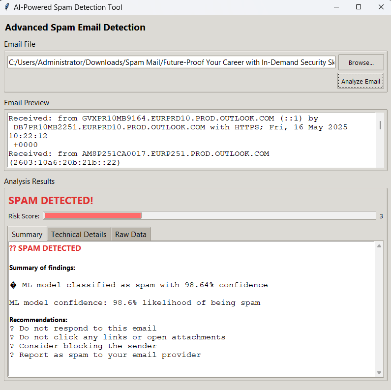
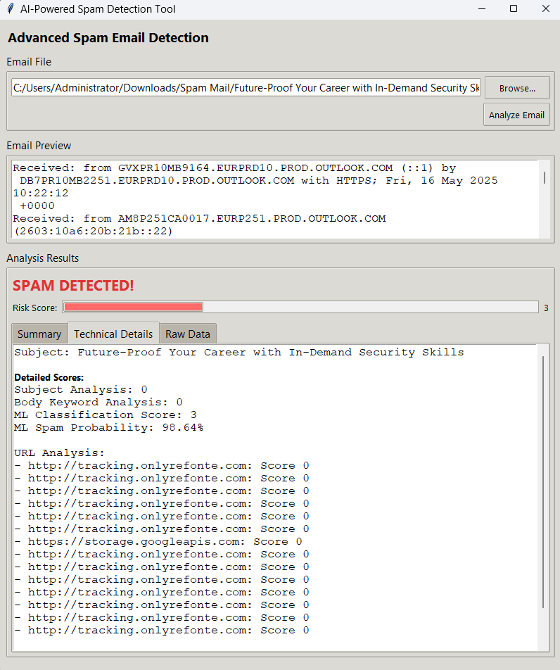
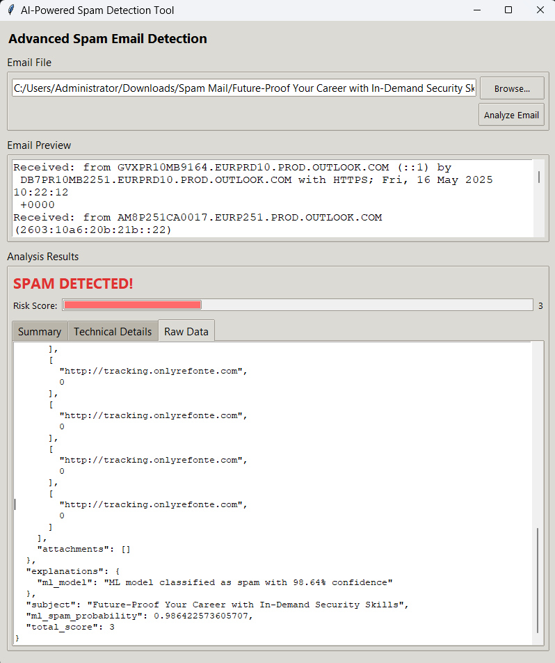
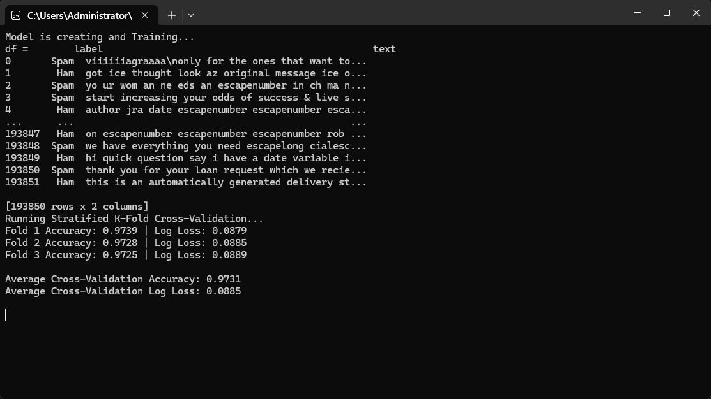

# Capstone-Project-Advanced-Spam-Email-Detection

This project implements an advanced spam email detection system using Python. It combines machine learning, keyword analysis, and external reputation services to identify spam emails effectively. Additionally, it offers a user-friendly graphical interface for easy email analysis.
Features

    Spam detection engine combining:

        Logistic Regression ML model trained on TF-IDF features

        Keyword matching with an expanded spam keyword list

        Sender IP reputation check via AbuseIPDB API

        URL and attachment reputation checks using VirusTotal API

    Robust email parsing including multipart and HTML emails

    Detailed analysis output with scores and explanations

    Interactive GUI built with tkinter for email file selection, preview, and result display

    Multi-tab result visualization: summary, technical details, and raw JSON data

    Sample example emails for quick testing

Requirements

    Python 3.x

    Python packages (install via pip):

        numpy

        pandas

        scikit-learn

        requests

        html2text

        python-dotenv

        joblib

Installation and Setup

    Clone this repository:
```
git clone https://github.com/yourusername/capstone-spam-detection.git
cd capstone-spam-detection
```
Install required packages:

pip install -r requirements.txt

Configure API keys by creating a .env file in the root directory with the following keys:
```
    ABUSEIPDB_API_KEY=your_abuseipdb_api_key
    VIRUSTOTAL_API_KEY=your_virustotal_api_key
```
    Ensure the spam/ham dataset CSV (spam_ham_dataset.csv) is placed in the project directory or update the path inside the code accordingly.

Usage
Running the GUI

Start the graphical interface to analyze emails interactively:
```
python capstone_ui.py
```
    Browse and select .eml or .txt email files.

    Preview the email content.

    Click "Analyze Email" to perform spam detection.

    View results in multiple tabs, including a risk score and detailed explanations.

Using the Detection Function Programmatically

You can also use the detection function is_spam_email directly:
```
from capstone import is_spam_email

with open("sample_email.eml", "r", encoding="utf-8") as f:
    email_text = f.read()

is_spam, details = is_spam_email(email_text)

print(f"Spam detected: {is_spam}")
print(details)
```
How It Works

    The email is parsed to extract sender IP, subject, body, attachments, and URLs.

    Sender IP reputation is checked using AbuseIPDB.

    Spam keywords are matched in subject and body.

    The body text is classified by a machine learning model trained on a spam/ham dataset.

    URLs and attachments are checked against VirusTotal for malicious content.

    Scores from all checks are combined to produce a final spam risk score.

    The GUI visualizes this data clearly, providing actionable insights.

GUI

    
    
    
    

